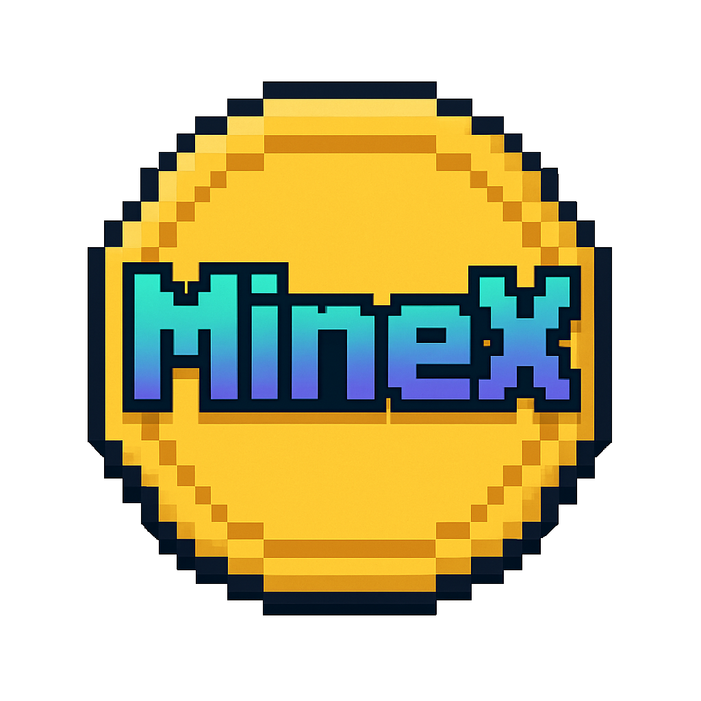
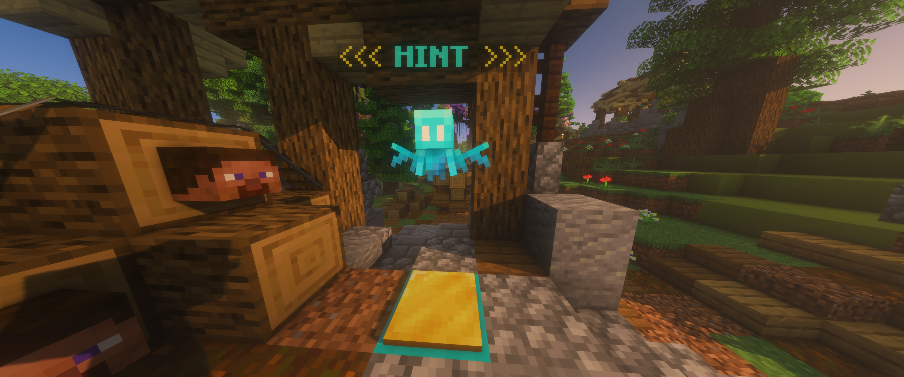
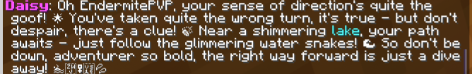
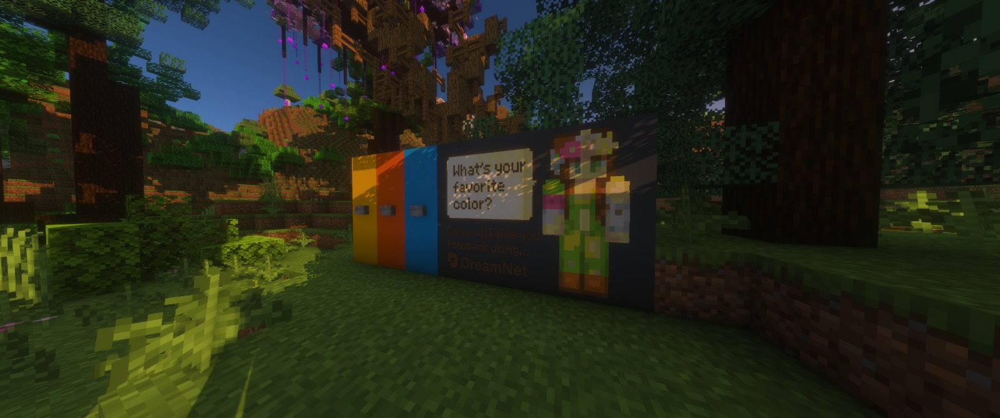
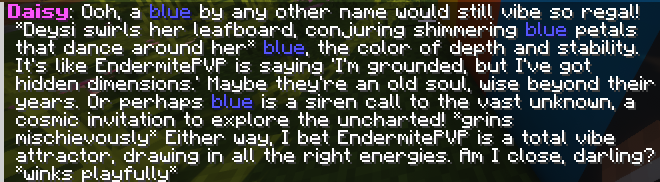

# MineX – DreamNet Character Agent Hackathon Submission



> 🏆 **Prize Winner!** MineX secured a prize at the **DreamNet Character Agent Hackathon** thanks to this plugin.  
> Check the official announcement on [X](https://x.com/MineXsol/status/1943784345170587664).  
> Huge thanks to the DreamNet team for organizing such an inspiring event!


> **Unlocking true ownership for 350&nbsp;million Minecraft players.**

MineX is a **Minecraft server project** that bridges Web2 gameplay with Web3 ownership and AI-driven storytelling. For the **DreamNet Character Agent Hackathon**, we integrated DreamNet’s webhook and API to add original, fun, and dynamic AI-powered interactions to an special story mode and throughout the map. MineX is not affiliated with DreamNet outside of this hackathon (yet).

---

## ✨ What is MineX?

MineX is a next-generation Minecraft server designed to:
- Unlock true digital asset ownership for players by integrating on-chain wallets and asset management.
- Provide a unique story-driven quest ("Digital Garden Rescue") with interactive NPCs and puzzles.
- Seamlessly blend traditional Minecraft gameplay with blockchain features and AI-generated narrative.
- Use DreamNet’s AI only for this hackathon to enhance Daisy’s character dialogue and quest flavor.
- Provide a **ready-made plugin + webhook template** so other Minecraft server owners can integrate DreamNet agents into their own worlds in minutes.

Players explore the map, interact with Daisy in story mode, and encounter AI-powered events and messages as part of the quest and in various locations.

---

## 🎮 Quick Start: Play DreamNet Instantly!

You don’t need to own Minecraft to play! Just follow these easy steps:

### 1. Download SKlauncher (Free)
- Go to the official SKlauncher website: [https://skmedix.pl/](https://skmedix.pl/)
- Download and install SKlauncher on your computer.

### 2. Launch SKlauncher in Offline Mode
- Open SKlauncher.
- Click on “Offline” to play without a Mojang/Microsoft account.

### 3. Select the Correct Minecraft Version
- In SKlauncher, choose or add a custom version: **1.21.6** (the server version).

### 4. Join Multiplayer
- Click on “Multiplayer” in the Minecraft main menu.

### 5. Add and Join the DreamNet Server
- Click “Add Server.”
- Enter the following details:
  - **Server Name:** DreamNet Demo
  - **Server Address:** `170.205.30.59:25594`
- Click “Done,” then select the server and click “Join Server.”

---

### What to Do In-Game

- Explore the map and follow the story prompts to meet Daisy and progress through the Digital Garden Rescue quest.
- Experience AI-powered dialogue and original quest content throughout your adventure.

---

**That’s it! Enjoy your journey in DreamNet—no Minecraft account required.**

### 🎬 Demo Videos

<a href="https://youtu.be/M-3dmY4mVWM?si=Mu89EatQ8-IWserL" target="_blank" rel="noopener noreferrer"></a><br>
**▶ Click to play**

*60-second trailer that captures the high-level vision of MineX.*

<a href="https://youtu.be/IAEKAfLcz7A?si=vy8qXRv403NbA1g4" target="_blank" rel="noopener noreferrer"></a><br>
**▶ Click to play**

*Long-form, unedited session covering the core quest.*

This is the link to our <a href="https://x.com/MineXsol/status/1941931966808367572" target="_blank" rel="noopener noreferrer">Tweet on X</a> announcing our participation — you can see some pictures there!

Our broader roadmap (see below) brings **on-chain AI agents** to every player via smart wallets. DreamNet’s technology is a perfect fit for this, as outlined in the <a href="https://minex-solana.gitbook.io/minex-world-chain/basics/5.-ai-agents" target="_blank" rel="noopener noreferrer">MineX AI Agents spec</a>.

Visit **<a href="https://MineX.gg" target="_blank" rel="noopener noreferrer">MineX.gg</a>** for the latest news, server IPs, and community events.

### 🎯 Extra AI Interactions (off-camera)
> These proof-of-concept features don’t appear in the gameplay videos but showcase how DreamNet can enrich any corner of the map.

| First-Minigame Helper | Resulting Hint |
|---|---|
|  |  |
| *Step on an **Allay** statue to receive a dynamic clue about the hidden flower giving some location imput to DreamNet and getting the answer.* | *Hint text is colour-coded – your **name** and keywords like “lake” pop out.* |

| Colour Picker | AI Response |
|---|---|
|  |  |
| *Press a coloured crystal. The prompt "What’s your favourite colour?" is sent to DreamNet along with your username.* | *Daisy riffs on your choice, guessing why **you**, with that username, picked it.* |

---

## 🛠️ How It Works

### DreamNet Integration (for Hackathon)
Our set-up uses DreamNet’s **Agents API** exactly as it would run in production:

1. **Outbound request (server → DreamNet)**  
   The plugin builds a small JSON payload using `HttpUtil.buildJson`:
   ```json
   { "text": "<player prompt>", "user": "<playerName>" }
   ```
   and posts it to:
   ```
   POST https://agents-api.doodles.app/<AGENT_ID>/user/message
   Headers:  x-mini-app-id: <APP_ID>
             x-mini-app-secret: <APP_SECRET>
   ```
   We call this with `HttpUtil.sendJsonAsync(...)`, so the Bukkit main thread never blocks.

2. **Inbound webhook (DreamNet → Netlify → Minecraft)**  
   DreamNet streams the assistant reply to our Netlify Function `/api/dreamnet-hook`.  
   The function forwards the text via a WebSocket back to the Minecraft plugin, where we broadcast it with:
   ```java
   Bukkit.getScheduler().runTask(plugin, () -> broadcast(TextColorUtil.applyDynamicColors(msg, playerName)));
   ```

3. **Session memory & clean-up**  
   DreamNet keeps a short-lived memory per `user` so Daisy can reference previous lines.  
   After each quest step we call `DELETE /agent/<id>/memory/<user>` to reset context and avoid spoilers.

4. **Dynamic colour pass**  
   Before chat is shown, `TextColorUtil` highlights:
   - the player’s name (gold & bold)
   - the word **lake** (aqua)
   - any colour word (red, blue, …) with its matching `ChatColor`.

The result is near-instant, personalised, and visually rich AI dialogue — all powered by DreamNet under the hood.

### Architecture

```
┌────────────┐         ┌────────────────────────┐
│  Player    │ ──────▶│ MineX Minecraft Server │
└────────────┘         │  • Story & Quests      │
                       │  • API Server         │
                       │  • Webhook Server     │
                       └─────────┬─────────────┘
                                 │ REST/Webhook
                                 ▼
                    ┌──────────────────────────┐
                    │ DreamNet Agents API      │
                    └──────────────────────────┘
```

---

## 📂 Repository Contents

```
MineX/
├── src/                 # Minecraft **plugin** source (Java + YAML)
├── webhook/             # Netlify Function source (TypeScript)
├── build.gradle         # Gradle build (Spigot/Paper API)
├── README.md            # You are here 🚀
└── .gitignore           # Ignore build artifacts & IDE files
```

This repo ships **both** the plugin *and* the Netlify webhook—everything you need to reproduce the DreamNet integration locally. (We don’t include the full game world.) Clone, build, drop the JAR into any 1.21.x Spigot/Paper server and go!

---

## 🌱 Roadmap

- [ ] Attach Swig smart-wallets → token rewards on quest completion.  
- [ ] Persist quest state on-chain.  
- [ ] Multiplayer branching quests with AI memory.  
- [ ] Marketing push with influencers post-TGE.

---

## 🤝 Credits

| Role                  | Name                                    |
|-----------------------|-----------------------------------------|
| Founder & Lead Dev    | **Yeray Selva** (<a href="https://t.me/YeraySelva" target="_blank" rel="noopener noreferrer">Telegram</a>) |
| Minecraft Developer   | **Roberto Porfidia**                   |
| Builder               | **BreakerFinger**                       |
| Tester & Developer & Video Editor | **Borja García** |

Special thanks to **DreamNet** & **SendAI** for the agent platform, and to the whole hackathon crew for the inspiration.

---

## License

`Apache-2.0` – free to fork, hack, and grow 🌻
